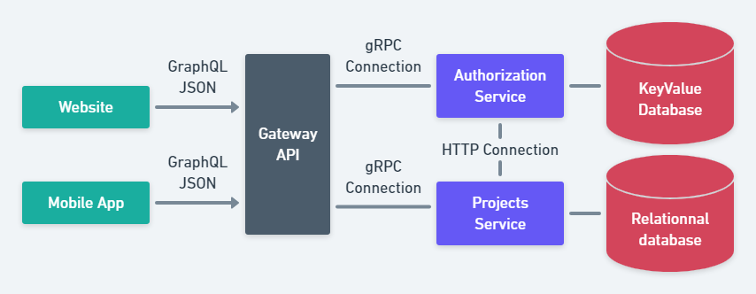
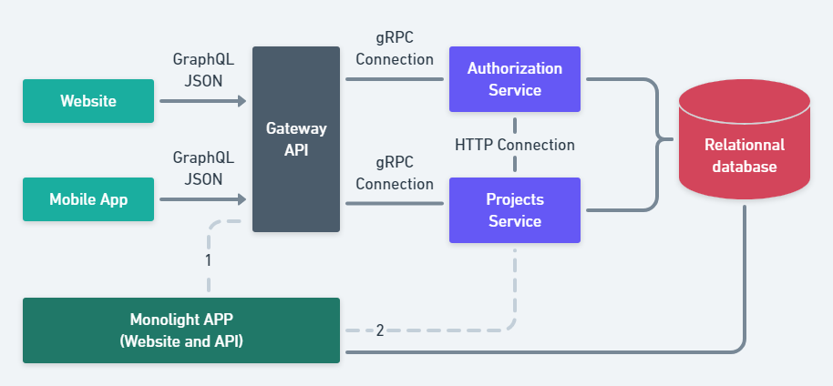
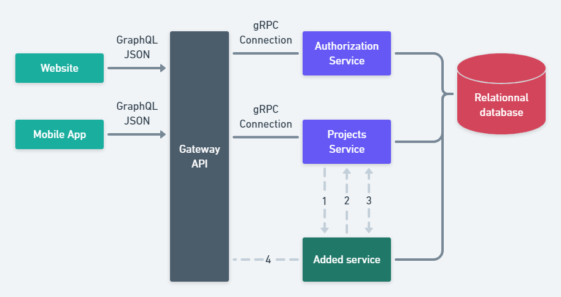
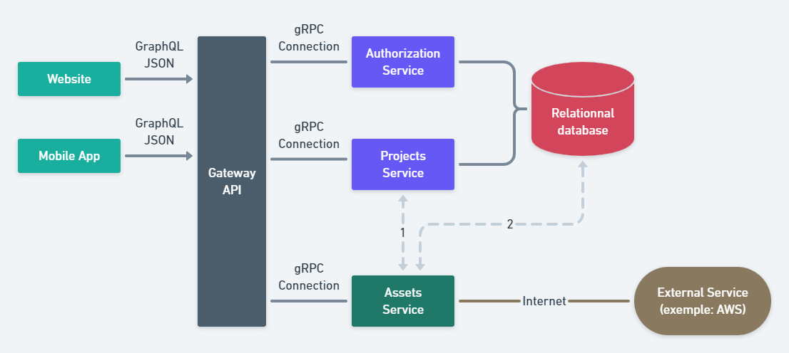

## Test backend

Solution implémenté en Go avec gRPC. 

Le serveur écoute par défaut sur le port 3123.

#### Variables d'env

```
PORT            default = 3123
JWT_SECRET      default = super_secret
JWT_EXPIRATION  default = 24h (go duration format)
```

#### Commandes importantes

- `make generate-proto` génère le code en go pour le fichier proto qui se trouve dans proto/sessions.proto
- `make tests` lance des tests sommaires sur l'implémentation du serveur
- `make run` lance le serveur grpc depuis `go run`
- `make docker-build` build l'image docker du serveur (image finale basé sur `scratch` et nommée `miimosa-test`)
- `make docker-run` run l'image docker fraîchement build

#### Libraries

- sirupsen/logrus pour le logging 
- cockroachdb/errors pour les erreurs, permet d'avoir des objets d'erreurs qui fonctionnent toujours à travers le réseau
- dgrijalva/jwt-go pour le management des jwt, utilisation avec signature hashé via sha256
- github.com/google/uuid pour générer des uuids pour les jwt
- github.com/kelseyhightower/envconfig pour gérer les variables d'environments (internal/config/app.go)
- google.golang.org/grpc & google.golang.org/protobuf pour grpc


## Question d'architecture 

### CAS 1
Dans le cas numéro 1, voici une architecture micro-service logistique basique, qui met en oeuvre une distribution 
backend pour un site et une app mobile.



#### Cette architecture rencontre-t-elle des problèmes ? Si oui lesquels ?

- La connexion entre "Authorization Service" et "Projects Service" se fait par une connexion http classique alors
  que ce sont deux services GRPC. La connexion devrait utiliser les clients grpc respectivement générés pour facilité
  la tâche des prochains développeurs et gagner en homogénéité. 
  
- On pourrait aussi reprocher à cette architecture d'avoir une connexion directe entre deux services. Cependant, avec le 
  manque d'informations il est difficile de savoir si la communication entre ces deux services ("Authorization Service" 
  et "Projects Service") se fait en hard-codant l'host de l'autre service ou pas.

- La communication synchrone entre deux micro services devraient être évité autant que possible. Cela ajoute des latences
  réseaux et des points de défaillance unique (spof) : qu'est ce qui se passe si "Authorization Service" 
  est down et qu'un des développeurs de "Projects Service" n'a pas géré le cas ?
 

#### Que changeriez-vous dans cette architecture ?

Pour moi il y aurait 3 changements possibles à opérer :

- Changer le type connexion entre "Authorization Service" et "Projects Service" par une connexion GRPC en utilisant les
  clients générés.
  
- Si la communication entre ces deux services se fait de manière hard-codé il faut la changer au profit de soit :
  - client side routing via :
      - une librairie client : qui va parler à une service registry (consul, eureka) et faire le load-balancing vers le 
        service demandé correctement.
        
      - communiquer avec un sidecar qui lui va taper sur la service registry et faire le load-balancing vers le service 
        demandé correctement.
    
    L'avantage du client side routing c'est que l'on a moins de latences réseaux car il y a moins d'aller retours qu'avec
    une gateway ou un service proxy.


  - la gatewa, qui a le rôle de rediriger le traffic de la bonne manière avec la bonne stratégie de load balancing, 
    du cache, des retry ect.
    
- Enfin il serait possible de déplacer la logique "Authorization Service" dans l'API Gateway pour
  supprimer le service et donc cette problématique de communication. En revanche, ce n'est possible que si la logique
  derrière ce service est simple.

------

### CAS 2

Dans le cas numéro 2, nous mettons en place une nouvelle architecture micro-service pour remplacer une application mono 
light. Nous avons fini le développement de la plateforme micro-service et nous souhaitons connecter notre monolight au 
service de projets.



#### Quels sont les pour et les contres de chaque connexions (représenté par les pointillés) ?

**Connexion 1**

Pour : Simplicité d'utilisation, la gateway va se charger de trouver le service, de faire le load-balancing, de gérer 
le cache, le retry ... 


Contre : + de latence réseau, en effet on parle d'abord avec la gateway qui va surement parler à la service registry
puis va parler au service concerné puis enfin qui va retourner la réponse du service.

**Connexion 2**

Pour : Moins de latences réseau puisqu'on communique "directement" avec le "Projects Service"

Contre : + complexe, car l'app devra avoir connaissance de l'host de "Projects Service" et donc parler à la service 
registry ou être déployé avec un sidecar qui s'occupe de ça.

#### Quel(s) connexion(s) choississeriez vous ?

Étant donné que la gateway existe, qu'elle fait tout le travail de load-balancing vers le service, de gérer
le cache, le retry ect. Je pencherai plus pour la connexion 1. 

Toutefois, si le service est critique et que la latence n'est pas permise alors la connexion 2 sera plus appropriée.

------

### CAS 3

Dans ce troisième cas, nous allons ajouter un service "Added service" qui est un service utilisé pour distribuer les 
commentaires des projets, dans l'architecture proposée, nous allons devoir connecter notre service pour le rendre 
accessible.



#### Quels sont les pour et les contres de chaque connexion (représenté par les pointillés) ?

**Connexion 1, 2 et 3**

Les avantages de ces connections sont qu'elles permettent un échange entre le "Projects Service" et "Added service". 
De sorte que "Added service" puisse par exemple vérifier que l'ID d'un projet existe pour la connextion 1 et 3.

Ces 3 connections ne rendent pas le service accessible, il peut l'être si "Project Services" expose un moyen de
communiquer avec lui mais cela implique plus de latences réseaux et de nombreux allers retours.

**Connexion 4**

Elle permet de rendre accessible Added service a "Mobile App" et "Website".

Implique de devoir faire scale la gateway pour pouvoir bénéficier des avantages qu'offre l'architecture micro service. 

Je m'explique admettons que "Added service" ait été créé car c'est un service critique qui a besoin d'être répliqué sur 
plusieurs instances, la gateway devra elle aussi absorber la charge de "Added service". 

Si on divise "Added service" en 4 réplicas et que derrière c'est la gateway qui prend toute la charge réseau parcequ'il 
n'y a qu'une seule instance alors ça revient à complexifier son infrastructure gratuitement.


#### Quel(s) connexion(s) choississeriez vous ?

En assumant que par rendre accessible on entend faire en sorte que le "Website" ou la "Mobile App" puisse appeller "Added
service" la connection 4 est la meilleure option car :

- la gateway gère le load balancing, le cache, les retry... 
- elle permet d'exposer Added service
- permet de ne pas ajouter de edge cases car dans ce schema toutes les connections sont faites depuis la gateway : créer 
une connection sans passer par elle revient à rajouter de la complexité dans l'infrastructure.

------

### CAS 4

Dans ce dernier cas, notre service d'assets à une dépendance à un bucket S3 chez AWS. Lors de l'upload d'un asset pour 
un projet via notre service, nous devons envoyer l'URI de l'asset au projet. Deux solutions sont possibles.



#### Quels sont les pour et les contres de chaque connexion (représenté par les pointillés) ?

**Connexion 1**

Pour : On modifie le projet à un seul endroit : dans le "Projects Service", plus simple pour débuguer et savoir pourquoi
par exemple on a tel valeur dans la bdd. 


Contre : + de latences réseau car on envoie d'abord une requête au "Projects Service" qui va faire une requête à la bdd
puis retourner le résultat, ça fait beaucoup d'aller retours.

**Connexion 2**

Pour : Plus simple, moins de latences réseau puisqu'on communique directement avec la base de donnée.


Contre : Ne respecte pas les bonnes pratiques, idéalement chaque micro service devrait
uniquement s'occuper de son propre datastore. Comme on modifie l'URI de l'asset du projet c'est le "Projects Service" 
qui devrait manipuler cette donnée. 

#### Quel(s) connexion(s) choississeriez vous ?

La connexion 1 car elle est plus "safe" et idiomatique que la connexion 2, c'est à dire qu'elle sera plus facile à 
maintenir dans le temps, qu'elle sera plus facile à débuguer et qu'elle respecte les bonnes pratiques en matière de 
micro services.

Personnellement j'aurai mis un message broker (rabbit mq ou kafka) et fait l'update de l ÚRI de l'asset du project de manière asynchrone. De tel
sorte que "Projects Service" écoute un topic ou channel en fonction du broker avec une garantie de livraison de message 
de type `At-least-once delivery` (on ne peut pas perdre de message, mais il peut être joué plusieurs fois donc la partie
qui consomme le message se doit d'être idem potent). 
